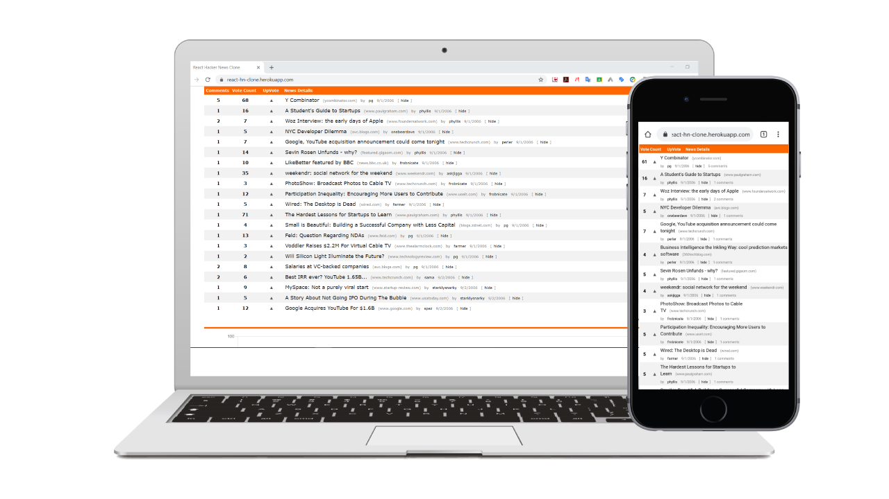
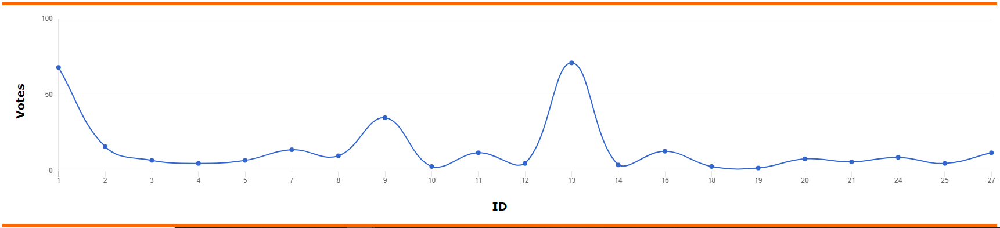

## Technical Overview

The idea behind this project is to design the clone of hacker news website using react.js with Server-side rendering technique and the application modules bundled using [Webpack](https://webpack.js.org/) Javascript module bundler and it uses [babel-loader](https://webpack.js.org/loaders/babel-loader/) to load the plugins with the given presets. 

To populate the votes in a line chart, it uses [react-chartkick](https://www.npmjs.com/package/react-chartkick) npm modules.

And the application has been built with [Travis-CI (continuous integration)](https://travis-ci.com/) and deployed to [Heroku](https://react-hn-clone.herokuapp.com/).



<p>
    
</p>

### Website link
[https://react-hn-clone.herokuapp.com/](https://react-hn-clone.herokuapp.com/)

### Installation
````````````````````````````````````````````````````````````````````````````
git clone https://github.com/anshumanpattnaik/react-js-hacker-news-clone.git
cd react-js-hacker-news-clone
yarn add
yarn run start
````````````````````````````````````````````````````````````````````````````

### References
1. [https://webpack.js.org/](https://webpack.js.org/)
2. [https://webpack.js.org/loaders/babel-loader/](https://webpack.js.org/loaders/babel-loader/)
3. [https://travis-ci.com/](https://travis-ci.com/)

### License
This project is licensed under the [MIT License](LICENSE)
